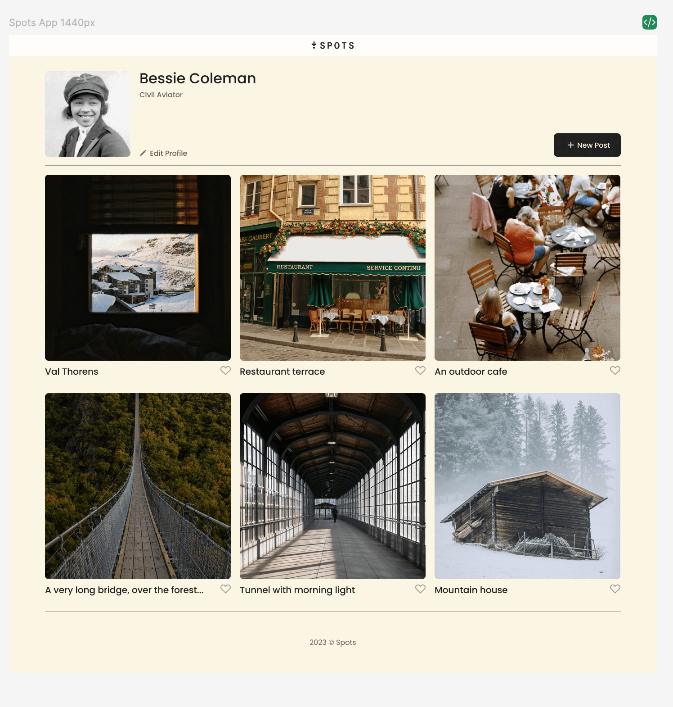
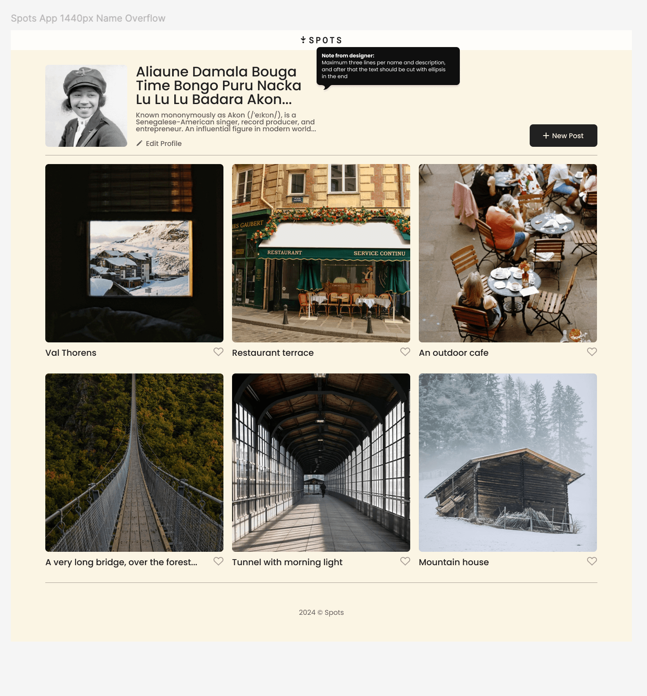
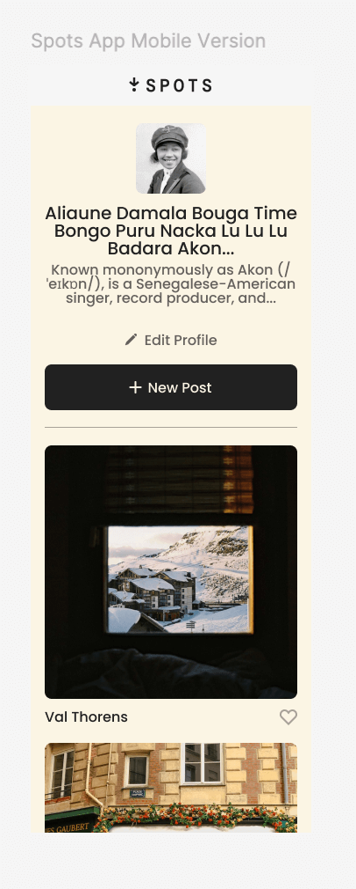

# Project 3: Spots

### Overview

- Intro
- Figma
- Images

**Intro**

Hello my name is Jordan-Michael Kirk. This project is made so all the elements are displayed correctly on popular screen sizes. It uses all the skills I have learned so far and uses them all together. I created this project from scratch creating the HTML latout and adding CSS to give the project the correct look and feel as directed by the FIGMA file attached.

**Figma**

- [Link to the project on Figma](https://www.figma.com/file/BBNm2bC3lj8QQMHlnqRsga/Sprint-3-Project-%E2%80%94-Spots?type=design&node-id=2%3A60&mode=design&t=afgNFybdorZO6cQo-1)

**Images**

Here are some examples of the different layouts of the project.

**Deployed Project**

- [link to the deployed project on GitHub](https://jmjk131-boop.github.io/se_project_spots/)

**Project Pitch Video**

Check out [this video](https://drive.google.com/file/d/1KijycIaFxDmaZuJ7LZVIixONOkfLj5jP/view?usp=drive_link), where I describe my project and some challenges I faced while building it.
